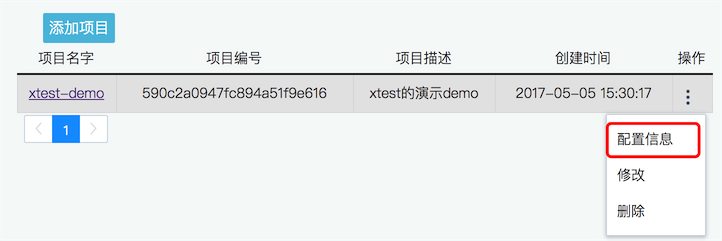

===============
新手快速使用
===============

使用步骤
========================

本方提供了基于 Python的Pyunit的Demo程序，大家只需要登录x-utest系统，修改配置信息即可运行使用。

客户端Demo
=====================

Demo地址：

.. code::

    https://github.com/x-utest/xtest-python-demo.git

登录x-utest系统，可以查找自己项目配置查找：

点击项目的菜单：

查看指定配置：

.. image:: ./images/xtest-client-config-1.png

在文件 **demo.py** 中替换掉原有的配置：

.. code::

    # todo 在系统中注册了,组织信息中看到这个值,替换到此处
    project_id = '590c2a0947fc894a51f9e616'
    app_id = '3832f354872411e6a7c700163e006b26'
    app_key = '38342936872411e6a7c700163e006b26'

然后运行程序(基于python3.5及以上) ：

.. code::

    python demo.py

运行结果如下：

.. code::

    (py3venv) harmo@harmo-pc:~/work/workspace/xtest-python-demo$ python demo.py
    FFF...
    ======================================================================
    FAIL: test_first_hello_world_false (__main__.MyTestDemo)
    用户不应该越权访问资源
    ----------------------------------------------------------------------
    Traceback (most recent call last):
      File "demo.py", line 65, in test_first_hello_world_false
        self.assertTrue(False, msg='Hello Word是失败的')
    AssertionError: False is not true : Hello Word是失败的

    ======================================================================
    FAIL: test_first_hello_world_false2 (__main__.MyTestDemo)
    此处用户操作太多内容了
    ----------------------------------------------------------------------
    Traceback (most recent call last):
      File "demo.py", line 71, in test_first_hello_world_false2
        self.assertTrue(False, msg='Hello Word是失败的')
    AssertionError: False is not true : Hello Word是失败的

    ======================================================================
    FAIL: test_first_hello_world_false3 (__main__.MyTestDemo)
    这个用户不是超级管理员
    ----------------------------------------------------------------------
    Traceback (most recent call last):
      File "demo.py", line 77, in test_first_hello_world_false3
        self.assertTrue(False, msg='Hello Word是失败的')
    AssertionError: False is not true : Hello Word是失败的

    ----------------------------------------------------------------------
    Ran 6 tests in 0.000s

    FAILED (failures=3)
    {"code":200,"msg":"success","data":""}

其中，最后的：

.. code::

    {"code":200,"msg":"success","data":""}

的 success 表明上传报告服务器成功

执行完毕后，即可在自己的 x-utest系统 界面看到相应的报告，并进行分享

