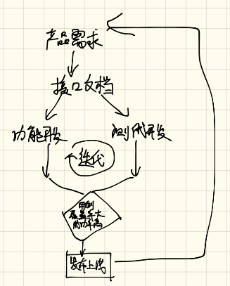

===============
有效工作流
===============

开发工作流
===============

大家都试着构想过这样一种工作流：

1. 小组成员一起开会设计好系统
2. 定义好接口并形成书面文档
3. 开发人员负责 **软件功能项目** 和测试人员负责 **测试用例项目**，同步开发
4. 长时间的小步快速开发和迭代，功能和用例数都不断增长
5. 功能项目的目标是让所有的测试用例都通过
6. 最终达成团队的预期目标，项目上线

工程流程图如下：

流程优势
============

以上工作流的好处如下：

1. 开发和测试同步进行，人员得到最大化利用
2. 让小步和快速迭代上线成为可能，极大降低了项目无谓的消耗和项目失败的风险
3. 每个过程都严格的让测试用例对软件质量进行了有效把控
4. 测试用例的总数和成功总数对软件这个黑盒形成了良好的 **量化**
5. 整个开发过程和进度对于 **不懂技术** 的团队成员也是 **完全透明** 的

整个过程用两句话可以描述：

1. 测试 **驱动** 开发
2. 测试 **量化** 开发

当然，一个IT企业，做到以上是非常不容易的，但是可以朝向这个方向不断前进。

本文先介绍一个系统来助力IT企业实现这一目标。在实现这一目标之前，先达成一个小目标：

让企业重视软件质量，提升软件质量控制的 **技术和方法论** ，让软件测试活动变得 **流行** 起来，让软件测试成为整体软件生产活动中的 **高频事件** 。

为了上述的小目标落地，那么先要到如下几点：

1. 让软件测试工作确实起到 **量化** 开发过程的作用
2. 加速测试重要产出物 ***测试报告** 的曝光度和传播度

三方系统
=============

借助 **xtest系统** 可以有效实现这个目标：

1. 测试开发人员完成自动化测试项目的编写
2. 提取测试项目的报告
3. 按照 **xtest系统** 组织成 **规范的报告格式**
4. 上传测试报告到 **xtest系统**
5. 根据时间线形成完整的 **产品成长量化图**
6. 形成直观的 **测试报告分享报表**，直接分享给协作人员查看