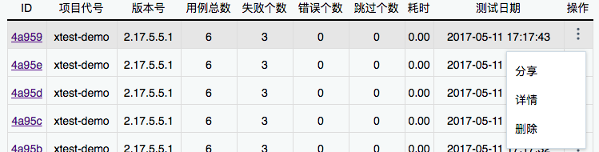
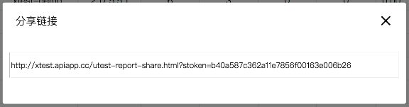
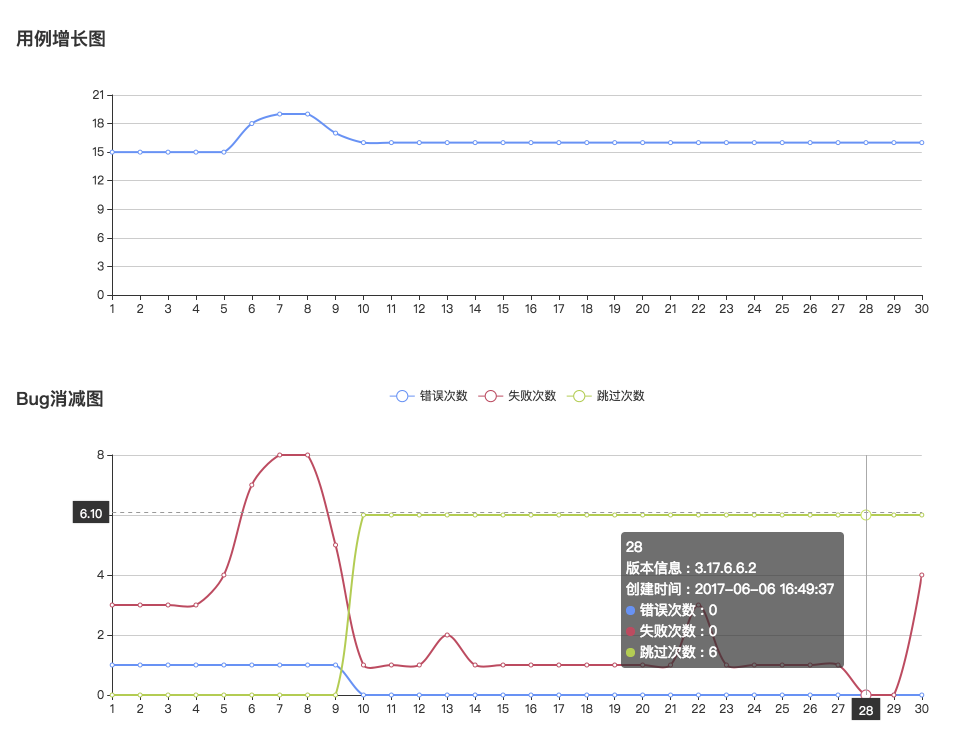

===================
Xtest系统
===================

系统简介
===============

`系统主页 <http://gtestbce.gtapp.xyz>`__：

.. code::

    http://gtestbce.gtapp.xyz/

使用步骤：

1. 微信扫码登录
#. 创建一个项目，查看详细配置信息
#. 下载sdk-demo
#. 填写自己的配置信息
#. 运行demo
#. 上传demo的测试结果
#. 分享可视化的报告
#. 查看项目成长图

本系统主要的受众是： 自动化测试工程师，拥有编码能力的测试开发人员。

如果你不会开发，只会点点点鼠标操作的，请绕道先回去补充基础知识再来尝试使用本系统。

本系统主要解决如下几个问题：

1. 测试报告的自动化生成及存储
2. 测试报告的信息流转
3. 以测试报告来量化整个项目周期

可视化测试报告图
====================

形成稳定的产品测试线路图：

对测试记录生成 **分享链接** ，供其他非登录用户直接进行访问：

`示例链接地址 <http://gtestbce.gtapp.xyz/utest-report-share.html?stoken=36000fd42e7d11e89c65fa163e5f7caa0f810403>`_

被分享和传播的精美测试报告：

.. image:: ./images/xtest-share-report.png

可以任意邮件或者QQ微信进行分享和传播，极大的提高了报告的 **可读性和传播性**。

可视化项目成长图
====================

在人多的测试报告数据进行累积后，可以形成清晰的产品线路图。

效果图：

对测试记录生成 **分享链接** ，供其他非登录用户直接进行访问。

`示例链接地址 <http://gtestbce.gtapp.xyz/pro-report-share.html?stoken=9999b2e2272b11e89c65fa163e5f7caa5ec19263>`__

主要特点：

1. 以测试用例的数目和失败数量来量化开发过程
2. 最终失败用例数是趋向于0的
3. 随着功能的增加，总的用例数原则上是一直在增长的
4. 以用例成功率来衡量每个版本的发布节点

定位和展望
==============

系统定位：

1. 本系统定位为 **自动化** 判定测试报告系统
2. 没有代码执行系统，需要自己去写测试代码本地执行
3. 可以将执行系统放在Jenkins里面去自动构建触发你的执行代码，然后将测试结果显示到本系统中
4. Jenkins只能显示构建的历史，然后本系统可以显示测试的历史，刚好可以成为一个补充

后续展望：

1. 提供看板报表功能，将量化过程投影到公司电视墙上
2. 自动化SAAS服务器再触发相应的webhook，回调到后续的系统（例如：自动化发布系统）
3. 对接Jenkins等持续集成

关于xtest系统，目前还有些功能在完善中，完善后再对外开放，相当于测试界人员的福利吧。

后文提要
==============

在正式开始系统的长篇大论前，有必要综述一下本文的内容。

1. 展示了一种 **测试量化开发** 和 **测试驱动开发** 的工作流
2. 陈述了一些关于自动化测试的基本概念
3. 强调了一些必要的良好规范的开发习惯
4. 提出了一种自动化测试报告的报文格式
5. 给出了一种测试报告内容的提取的方法（以python下的测试框架pyunit为例子）
6. 介绍了一种pyunit和自动化报告平台的数据对接方法

最终希望本文能够给测试开发从业人员一些启示，同时本文提到的系统能够让：

1. 注重软件质量
2. 有条件做自动化测试

的软件公司形成良好的开发过程，成就自己高效透明的开发信息流。